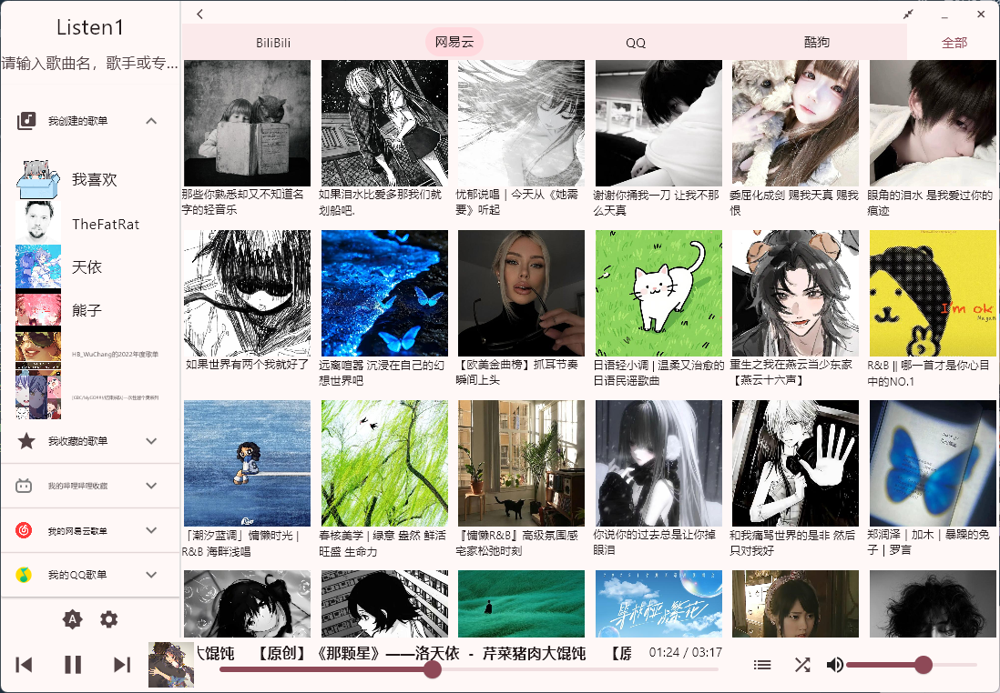

# listen1_xuan

本软件为flutter重写的Listen1
-https://www.bilibili.com/video/BV133VHzaEPt/
flutter version 3.35.7
# 第一次使用
## 安卓务必授予全部存储访问权限！！！
## 安卓务必授予全部存储访问权限！！！
## 安卓务必授予全部存储访问权限！！！
- 请在设置页面登录各平台账号以确保相应平台可用
- 播放即下载，安卓在Download/Listen1,win在默认下载文件夹/Listen1（win需要在设置中安装ffmpeg（若之前没有
有时间我再修改修改提示啥的
- 登录Github账号后可使用Github同步歌单、一键下载最新测试版
- 若网易、QQ、Github登录页面打不开，请尝试检查[webview2运行环境](https://github.com/jnschulze/flutter-webview-windows?tab=readme-ov-file#target-platform-requirements)
## ~~可能需要的~~提示
### Windows&Android
- 应用内在没有获取文本框焦点时，可使用如下按键：
  - E/.:下一首
  - Q/,:上一首
  - 空格:暂停/播放
  - W/↑:增大2％音量
  - S/↓:减小2％音量
  - D/←:前进3秒
  - A/→:后退3秒
###  Windows
- 在release页面下载windows压缩包后随意解压到任意目录，双击listen1_xuan.exe即可使用，可手动右键创建快捷方式到桌面或固定到“开始”
- 页面左侧及下方可以拖动、双击最大化/取消
- 页面右侧区域单击右键为返回，单击鼠标中键为隐藏至托盘
- “Listen1”处可右键隐藏至托盘、中间退出应用
- 托盘左键单击为显示应用，右键单击为显示菜单
- windows下载最新测试版后可能会弹出cmd请求管理员权限的提示，请点击允许以更新版本。若程序关闭后无法打开，请手动运行windows默认下载地址/Listen1/scripts.bat以更新版本
# TODO
- [x] 从WebSocket服务器下载缓存文件（连接服务器后在设置页面可进入
- [x] [小米手势条适配](https://dev.mi.com/xiaomihyperos/documentation/detail?pId=1629)
- [x] 安卓添加EQ音效调节功能
- [ ] 主题颜色根据歌曲变化
- [ ] @piano弱音
  - [x] 适配一下安卓Material You的自动配色
    - [x] (应用运行过程中壁纸变化自动更新颜色)
  - [ ] 把缓存文件前面加点来隐藏掉，就不会在其他本地音乐播放器中显示了
  - [ ] 下载功能着实好用，但是可能会招来平台不必要的麻烦（Listen1在2017年就是差不多这样），可以在源代码里留一个开关来打开功能
  - [ ] LineageOS（安卓14）会产生通知栏“播放”按钮变成旋转进度条
# 一些预览
## 横屏
### 主页、我的(各平台)歌单及各平台推荐歌单

### 歌单内容

### 选择分类

### 歌曲对话框

### 设置页面

## 竖屏
### 主页
 
### 选择分类
 
### 各平台歌单
 
### 歌单内容
 
 
### 歌曲对话框
 
### 搜索歌曲
 
### 歌手歌曲

### 设置页面
 
## [更新日志](./CHANGELOG.md)

帮我买杯蜜雪冰城能提升鼠鼠重写的积极性！

**Full Changelog**: https://github.com/HBWuChang/listen1_xuan/commits/first
