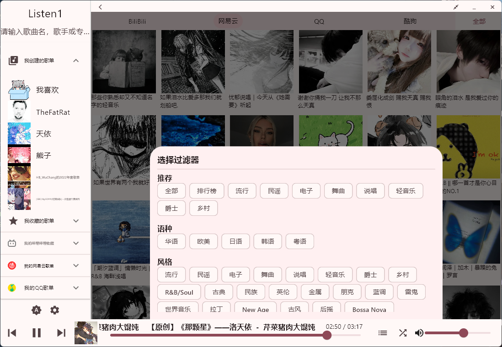
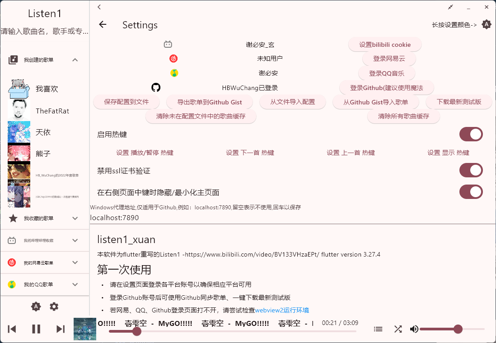
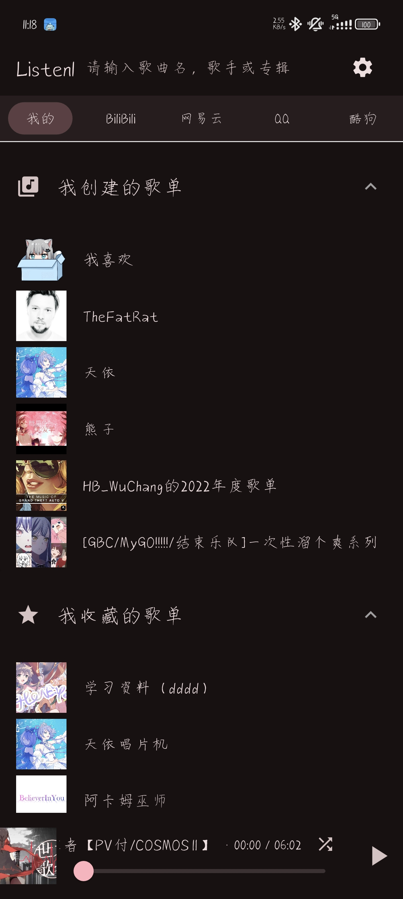
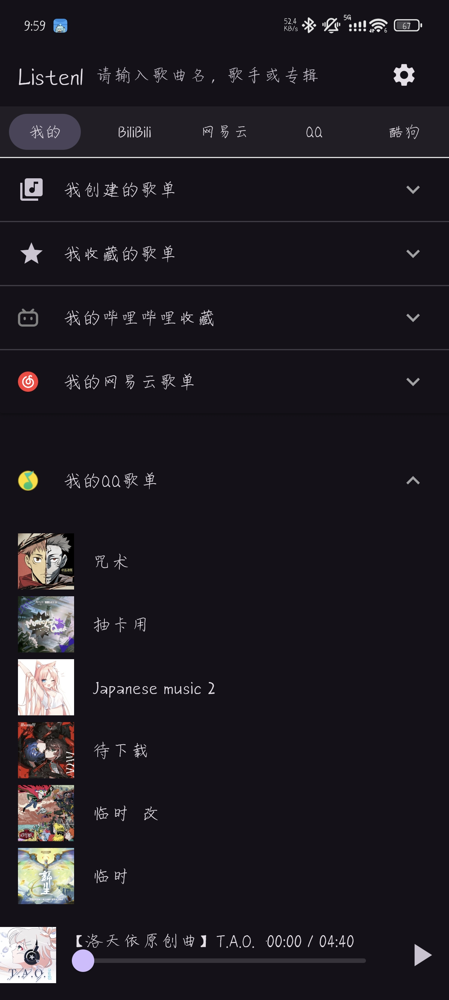
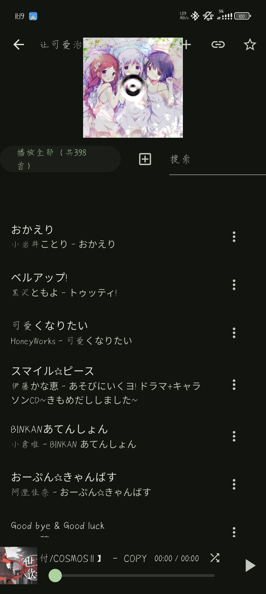

# listen1_xuan

本软件为flutter重写的Listen1
-https://www.bilibili.com/video/BV133VHzaEPt/
flutter version 3.27.4
# 第一次使用
- 请在设置页面登录各平台账号以确保相应平台可用
- 登录Github账号后可使用Github同步歌单、一键下载最新测试版
- 若网易、QQ、Github登录页面打不开，请尝试检查[webview2运行环境](https://github.com/jnschulze/flutter-webview-windows?tab=readme-ov-file#target-platform-requirements)
## ~~可能需要的~~提示
### Windows&Android
- 应用内在没有获取文本框焦点时，可使用如下按键：
  - E/.:下一首
  - Q/,:上一首
  - 空格:暂停/播放
  - W/↑:增大2％音量
  - S/↓:减小2％音量
  - D/←:前进3秒
  - A/→:后退3秒
###  Windows
- 在release页面下载windows压缩包后随意解压到任意目录，双击listen1_xuan.exe即可使用，可手动右键创建快捷方式到桌面或固定到“开始”
- 页面左侧及下方可以拖动、双击最大化/取消
- 页面右侧区域单击右键为返回，单击鼠标中键为隐藏至托盘
- “Listen1”处可右键隐藏至托盘、中间退出应用
- 托盘左键单击为显示应用，右键单击为显示菜单
- windows下载最新测试版后可能会弹出cmd请求管理员权限的提示，请点击允许以更新版本。若程序关闭后无法打开，请手动运行windows默认下载地址/Listen1/scripts.bat以更新版本
# 一些预览
## 横屏
### 主页、我的(各平台)歌单及各平台推荐歌单

### 歌单内容

### 选择分类

### 歌曲对话框

### 设置页面

## 竖屏
### 主页
 
### 选择分类
 
### 各平台歌单
 
### 歌单内容
 
 
### 歌曲对话框
 
### 搜索歌曲
 
### 歌手歌曲

### 设置页面
 
## 更新日志
---
1.0.3+13
- 可自选主题色
- 播放区域添加设置播放模式按钮
---
1.0.1+10
- Windows平台支持
- 适配横屏
- 修复部分bug
---
1.0.1+**9**
- 大幅更改页面切换逻辑
- 去除歌单的标题滚动效果，大幅提升性能
- 发布及actions将生成分架构安装包，减小安装包体积
- 修复部分bug
---
1.0.0+7
- 酷狗音乐源可用（但无法登录账号~~原Listen1就没有实现~~
- QQ音乐登录会员可用
- 土法手搓音乐列表滚动条
- 设置添加“禁用ssl证书验证”开关
- 歌曲弹窗可长按复制作者、专辑、链接或点击“搜索此音乐”快速搜索歌名
- 返回主页后一秒内两次返回可退出应用
---
1.0.0+6
- 可使用Github同步歌单
- 修复歌单区域显示不全的bug
---
1.0.0+5
- QQ音乐可用
- 随系统自适应暗色
- 修复断网导致音乐停止播放
- 增加应用内音量调节
- 增加清除音乐缓存功能
#### 登陆状态不会储存到配置文件中，不同设备需分别登录
---
1.0.0+4
- 网易云歌单可用
---
1.0.0+3
- 左右滑动下方音乐控制条可切换上一首下一首（震动反馈
- 点击音乐控制条可显示当前歌曲信息
- 长按音乐控制条可切换播放模式（震动反馈
- 双击音乐控制条可暂停/播放（震动反馈
- 创建歌单内歌曲可拖动排序
- 可查看网易云歌曲的专辑及歌手对应歌曲
---
1.0.0+2
- 现在可以读取listen1导出的配置文件及导出配置文件
- 修复部分播放模式bug
- 改善随机模式逻辑
---
1.0.0
- 可以登录哔哩哔哩和网易云账号
- 可以搜索哔哩哔哩和网易云音乐
- 可以查看哔哩哔哩收藏夹和订阅
- 可查看哔哩哔哩和网易云歌单
- 请现在右上角设置输入哔哩哔哩cookie和登录网易云账号
- 输入哔哩哔哩cookie需扫码，可将网址在电脑打开或手机开小窗投屏：https://[mashir0-bilibili-qr-login.hf.space](https://mashir0-bilibili-qr-login.hf.space/)/
- 在未输入哔哩哔哩cookie时进入主页会报错（暂时没有判断
**通知中的白色方框为切换播放模式按钮**当点击按钮时会弹出当前播放模式（循环、随机、单曲）（但是在通知页面无法查看，需关闭通知页面（试过自定义图标但还没有成功QwQ

帮我买杯蜜雪冰城能提升鼠鼠重写的积极性！

**Full Changelog**: https://github.com/HBWuChang/listen1_xuan/commits/first
